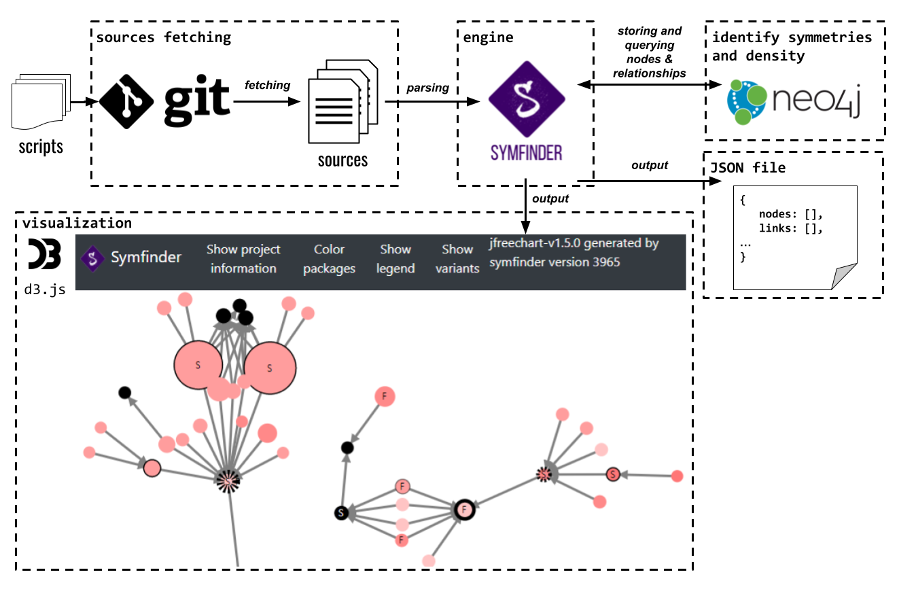

# How I Met Your Implemented Variability: Identification in Object-Oriented Systems with symfinder

## [Johann Mortara](https://j-mortara.github.io/) — [Philippe Collet](https://www.i3s.unice.fr/Philippe_Collet/)

## Table of Contents

- [Objectives](#objectives)
- [Prerequisites](#prerequisites)
- [Plan](#plan)
- [References](#references)

## Objectives

With this tutorial, we aim to provide academics and practitioners a practical experience of how the symfinder toolchain can assist variability identification activities in variability-rich object-oriented systems maintained in a single code base.
Participants will 

* learn about the underlying concepts of symfinder (i.e. symmetries in object-oriented mechanisms, density) and how they are used in the toolchain,
* learn how to run a symfinder analysis on one or multiple projects, and
* identify variability by interpreting the obtained visual results on both an example project and a project of their choice.

## Prerequisites

* Although symfinder also supports Windows systems, a machine running on either Linux or Mac is preferred;
* A functional Docker install.

## Plan

### Part 1 - Motivation and introduction to symfinder

* Introduction
* Feature location and feature identification: challenges and impact
* Identifying variability implementations in a OO codebase
* Features, variation points and variants
* Related work
* Symmetries in object-oriented constructs
* The theory of centers
* symfinder principles for feature identification
* Density of symmetries
* Visualization principles in symfinder

symfinder demo: see [https://deathstar3.github.io/symfinder-demo/](https://deathstar3.github.io/symfinder-demo/) for already presented demos

### Part 2 - symfinder: first contact

Presentation:

* Overview of the symfinder toolchain
* Tour of symfinder install
* Necessary yaml files (symfinder.yaml, experiments.yaml)
* Running symfinder
* Checking the output
* Accessing the visualization

Lab:

* Environment checking among attendees
* Docker installation (if needed)
* Running symfinder analysis on the example project
* Accessing the visualization
* Browsing and identifying variability (group work and exchange)

Remote execution of symfinder may be provided in case of problem with your machine.

### Part 3 - Guided use of symfinder

Lab: 

* Application to *your* system
* Discussion about identified variability implementations

[List of provided subject systems](subject-systems.md)

### Part 4 - Exchange time

Outline:

*  Sharing time of the conducted analyses on the different attendees' systems
*  Exchange time on observed variability implementations and architectures
*  Discussion on the usage of the different features of the symfinder visualization
*  Feedback time on the experience and possible improvements

## References

### Figures

#### Organization of the toolchain

_Click on the image to view full size_

#### Excerpts of visualizations

**symfinder**

_Click on the image to view full size_

**symfinder-2**

_Click on the image to view full size_

### Links

* Main symfinder site (code): [https://github.com/DeathStar3/symfinder](https://github.com/DeathStar3/symfinder)
* symfinder demo site: [https://deathstar3.github.io/symfinder-demo/](https://deathstar3.github.io/symfinder-demo/)
* Dockerized images : [https://hub.docker.com/u/deathstar3](https://hub.docker.com/u/deathstar3)
* Sharing space for the visualizations (TBD)
* [Tutorial's hall of fame](hall_of_fame.md)