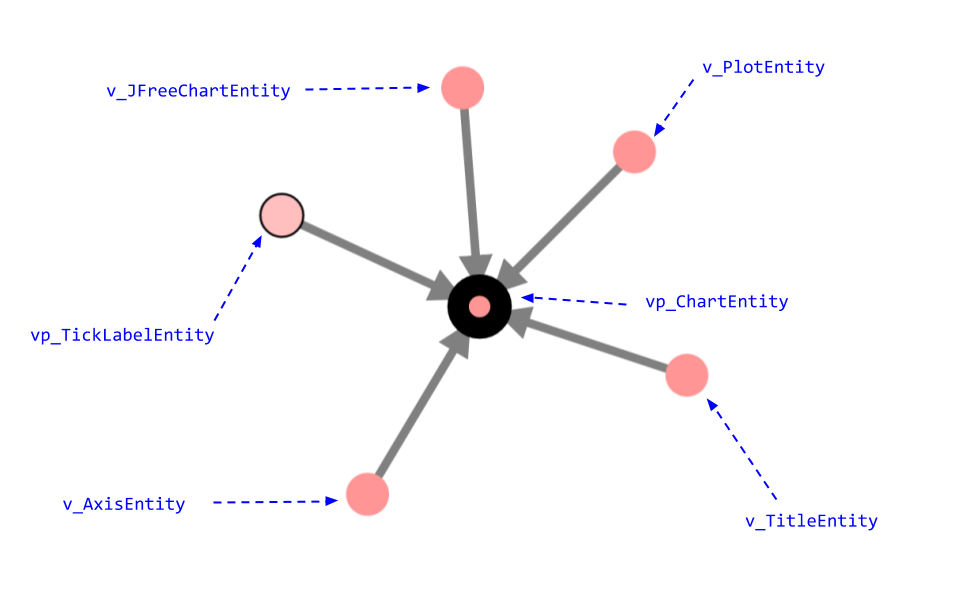
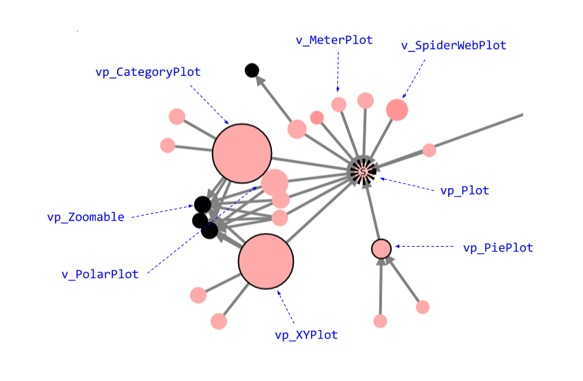
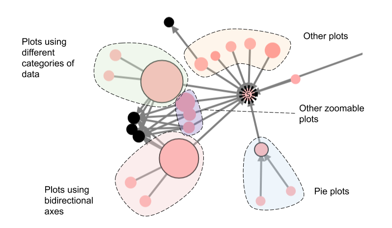
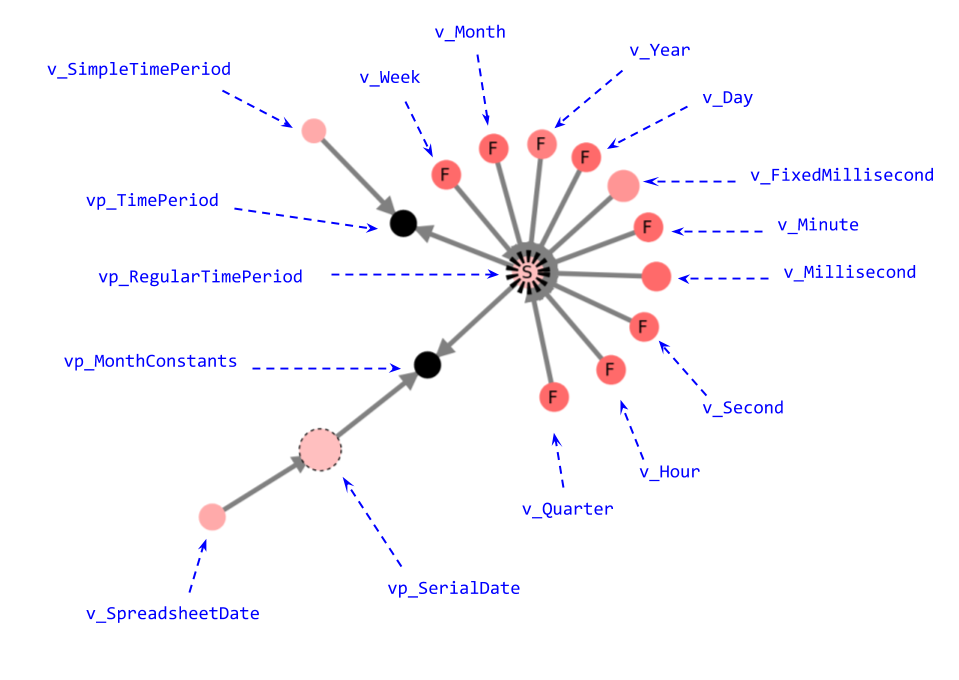
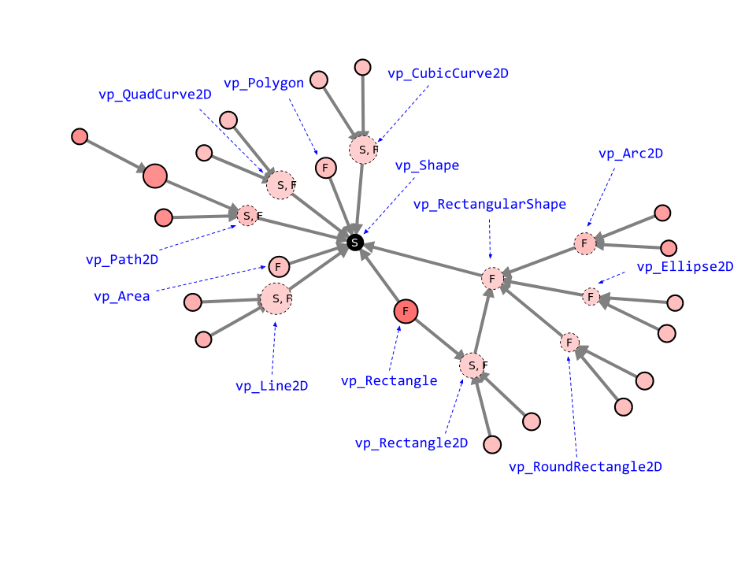
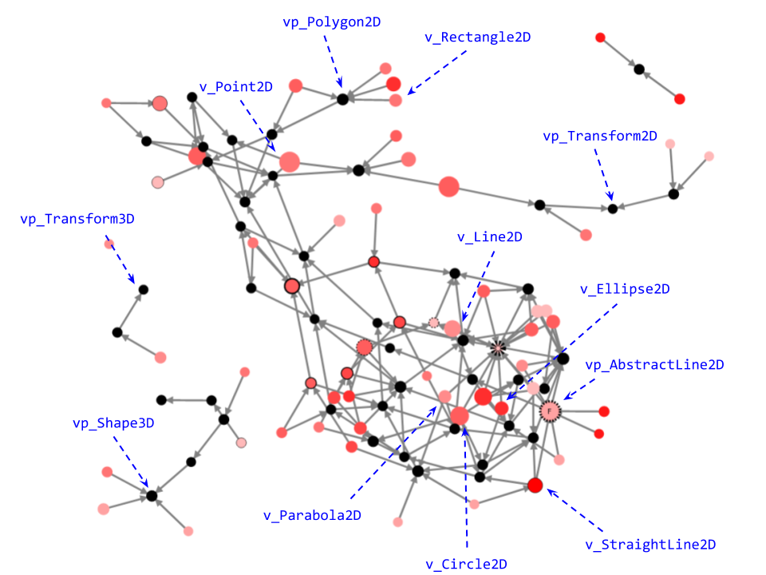
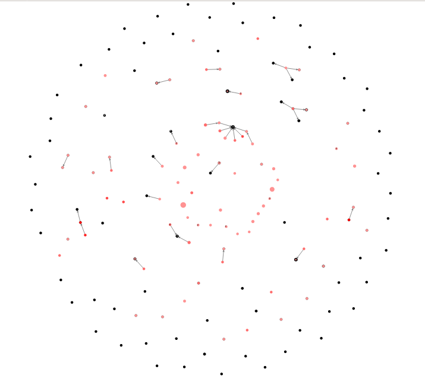
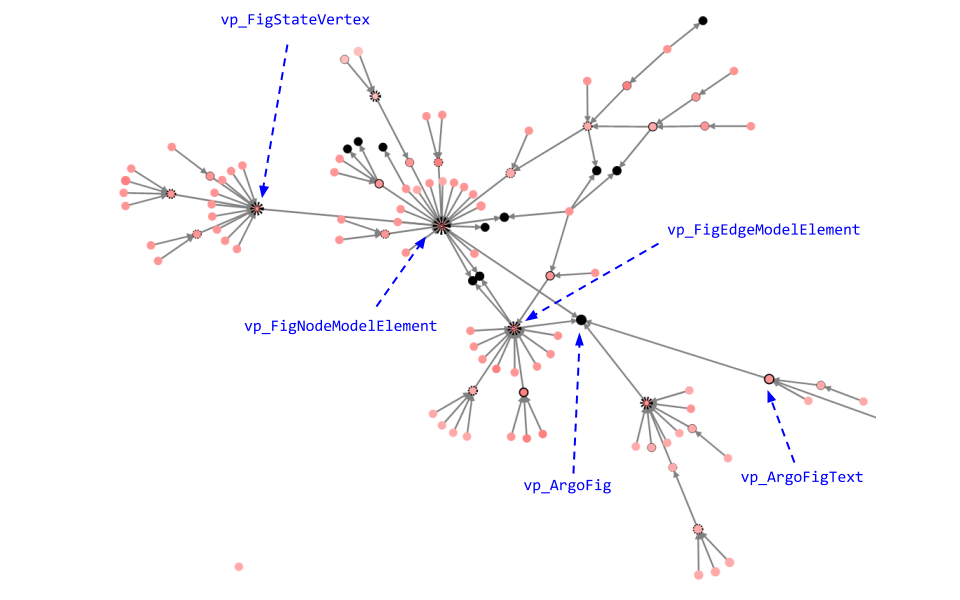

# Provided subject systems

## JFreeChart

JFreeChart is a Java charting library which helps in drawing charts of all types.

We observe in the visualization generated from this project the presence of variability at several places:

- The different entities that compose a chart

- The different types of plots that can be created

These detected variation points and variants can be linked to the features:

- The different periods of time that are used in temporal plots

### Java 8 AWT

AWT (Abstract Window Toolkit) is Java's original toolkit to build graphics, windows and user interfaces, before Swing. Still, AWT is used as the core of Swing.

As this framework helps in building graphics and figures, we can expect variability in the implementation of the different types of shapes that can be drawn.
This is indeed the case when we analyze the visualization. Here is shown an excerpt exhibiting `Shape` as a variation point and having multiple variants being variation points too representing different kinds of shapes:
- polygons (`vp_Polygon`)
- rectangles (`vp_Rectangle2D`)
- lines (`vp_Line2D`)
- ellipses (`vp_Ellipse2D`)
- arcs (`vp_Arc2D`)

### JavaGeom

JavaGeom is a Java library that provides methods to easily perform geometric computations, such as intersections of lines, clipping of polygons, transformation shapes, perimeter and area computations.

JavaGeom's visualization exhibits a single zone of high density of variability corresponding to the different types of 2D figures that can be drawn.

We can note that we find elements of variability similar to Java AWT's, which can be expected as both frameworks provide support for drawing figures.

We can also see that 3D shapes do not share any inheritance relationship with classes corresponding to 2D figures.

### JUnit

[JUnit](https://junit.org/junit4/) is a unit testing framework for Java. Its source code is concentrated in [a unique repository](https://github.com/junit-team/junit4/tree/r4.12).

Most of JUnit is an engine which runs unit tests. This explains why we do not find many variability implementations in the resulting visualization.

### ArgoUML

[ArgoUML](http://argouml-spl.tigris.org/) is an application allowing the user to build UML diagrams. It supports all standard UML 1.4 diagrams.
Its source code is available [here](https://github.com/marcusvnac/argouml-spl/tree/bcae37308b13b7ee62da0867a77d21a0141a0f18).

This code refactor allows us to view some implementations of variability, after having filtered some classes and packages:

- The following excerpts shows variants of `ArgoFig`, representing an element of a diagram

- By zooming on the variant `FigStateVertex` (which represents an element of a state chart), we can distinguish variants of states such as the initial and final states, as well as shallow and deep history states.
 (which is itself a variation point as it represents )

- The creation process of the different UML diagrams, achieved with factories inheritance.

